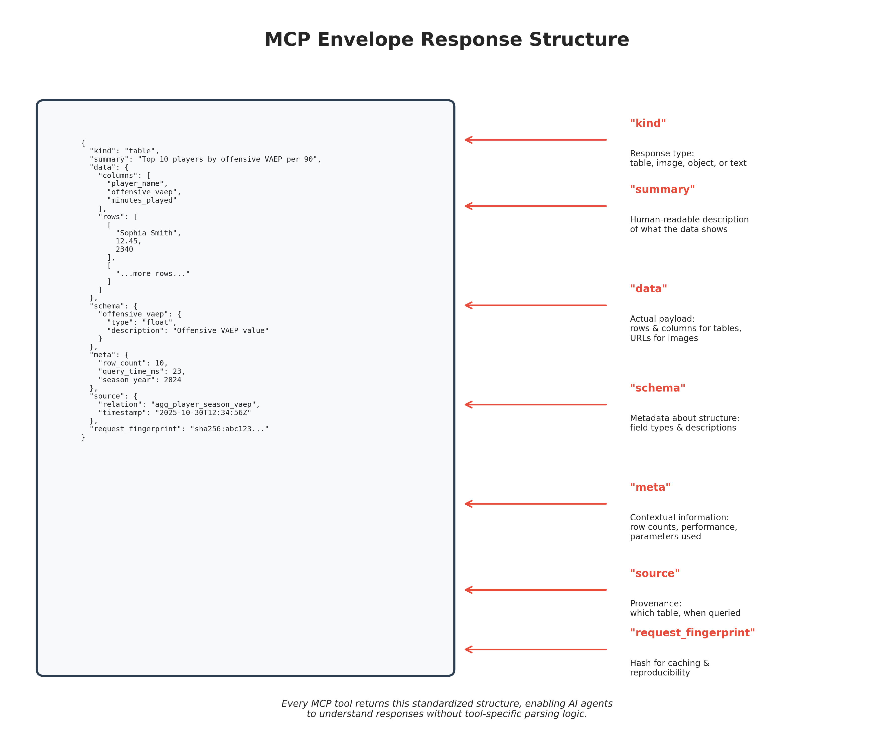

# The Linguistic Exposure Layer: How MCP Turned a Database Into a Conversation

Picture a data scientist staring at 2.58 million soccer actions stored in PostgreSQL tables. She knows the answer to "Who creates the most scoring chances?" lives somewhere in those rows, but extracting it requires writing SQL joins across `fact_spadl_action`, `dim_player`, and `agg_player_season_vaep`. She opens her notebook, types the question in plain English, and gets executable Python code that queries the database and visualizes the results. No SQL. No schema memorization. Just language.

This is the promise of the Model Context Protocol (MCP)—not as a framework, but as what we call a "linguistic exposure layer." The NWSL Data project demonstrates this principle at scale: 38 research-grade tools exposing a Kimball data warehouse to AI agents through nothing but language. When you ask "Compare Sophia Smith and Trinity Rodman's offensive VAEP in 2024," the system doesn't parse your intent into rigid API calls—it engages in genuine dialogue, routing your question through specialized tools (`query_player_metrics`, `compare_entities`, `calculate_distribution`) that return standardized envelopes of data.

The philosophical stakes are higher than convenience. MCP represents a shift from "applications with APIs" to "applications as linguistic subjects"—systems that become legible to AI by describing their capabilities in natural language. This isn't anthropomorphism; it's recognition that language has become the universal protocol for human-computer interaction. The NWSL platform proves this works at production scale: 1,322 matches, 895 players, 76 database tables, all accessible through conversation.

## What Is a Linguistic Exposure Layer?

Traditional software architecture treats language as a user interface concern—something that happens at the presentation layer, far removed from the data and business logic. You have databases that speak SQL, APIs that speak JSON, and user interfaces that translate between human language and these machine protocols. Each layer requires specialized knowledge: database administrators write queries, backend engineers design endpoints, frontend developers build forms.

MCP inverts this model. Instead of treating language as the outermost shell, it makes language the fundamental protocol at every layer. The database doesn't just store data—it describes what data it contains and how to query it. The analytics engine doesn't just compute metrics—it explains what those metrics mean and when to use them. The visualization service doesn't just render charts—it suggests which visualizations answer which questions.

This is what we mean by "linguistic exposure." The system exposes its capabilities through language, making itself legible to any agent—human or AI—that can engage in dialogue. You don't need to know that player performance data lives in `agg_player_season_vaep` or that VAEP stands for "Valuing Actions by Estimating Probabilities." You just ask about player performance, and the system routes your question to the right tool, which knows how to query the right table and return the right metrics.

The NWSL MCP server implements this through 38 specialized tools organized into five categories: Measurement & Observation (11 tools), Statistical Operations (4 tools), Temporal Analysis (3 tools), Comparative Analysis (3 tools), and Contextual Data Retrieval (4 tools). Each tool is a linguistic interface to a specific analytical capability. `query_player_metrics` knows how to fetch player statistics. `compare_entities` knows how to perform N-way comparisons with statistical testing. `calculate_distribution` knows how to compute percentiles and test for normality.


*The 38 MCP research tools organized by category, each providing objective measurements without storytelling bias.*

But here's the crucial insight: these aren't just API endpoints with natural language wrappers. They're designed from the ground up to be conversational. When you query player metrics, the tool doesn't just return a table—it returns a standardized envelope containing the data, a human-readable summary, schema information, metadata about the query, and provenance linking back to the source tables. The response isn't just data; it's a complete answer to your question, packaged in a way that both humans and AI agents can understand.

## The Architecture of Conversation


*The MCP linguistic exposure layer sits between AI agents and the database, translating natural language queries into SQL and returning standardized envelope responses.*

Let's trace what happens when you ask the NWSL system a question: "Which players had the highest offensive VAEP per 90 minutes in the 2024 season?"

First, your question reaches the MCP server, which exposes 38 tools via JSON-RPC 2.0 protocol. The server doesn't try to parse your natural language directly—that's the job of the AI agent (like Claude or ChatGPT) that's orchestrating the conversation. The agent analyzes your question and determines it needs the `query_player_metrics` tool.

The agent calls `query_player_metrics` with parameters:
```json
{
  "metrics": ["offensive_vaep", "minutes_played"],
  "season_years": [2024],
  "limit": 10
}
```

The tool validates these parameters using Pydantic schemas, ensuring type safety and catching errors before they reach the database. It then constructs a parameterized SQL query:

```sql
SELECT player_name, offensive_vaep, minutes_played,
       (offensive_vaep / (minutes_played / 90.0)) as offensive_vaep_per_90
FROM agg_player_season_vaep
WHERE season_year = $1
ORDER BY offensive_vaep_per_90 DESC
LIMIT $2
```

Notice what's happening here: the tool knows the database schema, understands the relationship between tables, and can compute derived metrics (VAEP per 90) on the fly. It's not just executing a query—it's reasoning about data.

The query executes against a PostgreSQL Kimball data warehouse containing 7.5GB of soccer analytics data. The warehouse follows dimensional modeling principles: fact tables store events and actions, dimension tables provide context (players, teams, matches), and aggregate tables pre-compute common summaries. The `agg_player_season_vaep` table is one of 17 aggregate tables, containing season-level VAEP metrics for 895 players across 10 seasons (2016-2025).

The tool receives the query results and packages them into a standardized envelope:

```json
{
  "kind": "table",
  "summary": "Top 10 players by offensive VAEP per 90 minutes in 2024 season",
  "data": {
    "columns": ["player_name", "offensive_vaep", "minutes_played", "offensive_vaep_per_90"],
    "rows": [...]
  },
  "schema": {
    "offensive_vaep": {"type": "float", "description": "Offensive VAEP value"},
    "minutes_played": {"type": "integer", "description": "Total minutes played"}
  },
  "meta": {
    "row_count": 10,
    "query_time_ms": 23,
    "season_year": 2024
  },
  "source": {
    "relation": "agg_player_season_vaep",
    "timestamp": "2025-10-30T12:34:56Z"
  },
  "request_fingerprint": "sha256:abc123..."
}
```

This envelope structure is crucial. It's not just data—it's a complete response that includes:
- **kind**: What type of response this is (table, image, object, or text)
- **summary**: A human-readable description of what the data shows
- **data**: The actual payload (rows and columns for tables, URLs for images)
- **schema**: Metadata about the data structure and what each field means
- **meta**: Contextual information (row counts, query performance, parameters used)
- **source**: Provenance information (which table, when it was queried)
- **request_fingerprint**: A hash for caching and reproducibility


*The standardized envelope response structure that all MCP tools return, enabling AI agents to understand responses without tool-specific parsing logic.*

The AI agent receives this envelope and can now do several things:present the data to you in a readable format, generate a visualization, perform follow-up analysis, or answer related questions. Because the envelope includes schema and metadata, the agent understands what the data represents without needing to guess.

But here's where it gets interesting: you can now ask a follow-up question like "How does Sophia Smith compare to the league average?" The agent doesn't need to start from scratch—it can use the context from the previous query (it knows we're talking about offensive VAEP per 90 in 2024) and call `calculate_percentile_rank` to determine where Sophia Smith falls in the distribution. The conversation builds on itself, with each exchange adding context and enabling more sophisticated analysis.

## From API to Dialogue

Traditional APIs are transactional. You make a request, you get a response, the interaction ends. There's no memory, no context, no conversation. If you want to perform a multi-step analysis, you need to orchestrate multiple API calls yourself, managing state and handling errors at each step.

MCP enables something different: genuine dialogue with data systems. The AI agent maintains conversation context, remembers what you've asked before, and can chain together multiple tool calls to answer complex questions. When you ask "Compare the top 5 scorers in 2024 and show me their shot maps," the agent:

1. Calls `query_player_metrics` to identify the top 5 scorers
2. Calls `generate_visualization` five times to create shot maps for each player
3. Calls `compare_entities` to generate a statistical comparison table
4. Synthesizes all this information into a coherent response

You didn't need to specify these steps—the agent figured out the workflow based on your question and the available tools. This is the power of linguistic exposure: the system describes its capabilities in language, and the agent can reason about how to combine those capabilities to answer your question.

The NWSL system takes this further with smart defaults and intelligent routing. When you ask for a "shot map," the visualization tool doesn't fail if you don't specify a team or season—it defaults to the 2024 season and the Kansas City Current (the 2024 champions). When you ask about "passing patterns," it infers you probably want a pass network visualization rather than a heatmap. These defaults are documented in the tool's response metadata, so you know what assumptions were made.

This approach solves a fundamental problem in data analytics: the gap between what users want to know and what they need to specify to get an answer. Traditional systems require you to translate your question into the system's language—SQL queries, API parameters, configuration files. MCP systems translate themselves into your language, meeting you where you are.


*From natural language to executable code: the MCP layer translates conversational queries into SQL, eliminating the need for users to know database schemas.*

## The Technical Foundation

Making this work at production scale requires careful engineering. The NWSL MCP server is deployed on Google Cloud Run with the following architecture:

**Database Layer**: PostgreSQL 14 on Google Cloud SQL (34.72.26.89:5432) containing:
- 76 tables following Kimball dimensional modeling
- 2.58M action-level events in `fact_spadl_action`
- 1,322 matches spanning 2013-2025
- Pre-computed aggregations at match, season, and career grains
- ML-derived metrics (xG, VAEP, xT, Point Shares) in dedicated fact tables

**MCP Server**: Python 3.9+ application exposing tools via two transports:
- **stdio transport**: For local clients like Claude Desktop (JSON-RPC over standard input/output)
- **HTTP+SSE transport**: For web clients (JSON-RPC over HTTP with Server-Sent Events)

**Tool Registry**: Centralized management of 38 tools with metadata:
- Tool descriptions and input schemas (Pydantic models)
- Category assignments (measurement, statistical, comparative, etc.)
- Agent assignments (research, visualization, code generation)

**Security Layer**: Multiple safeguards to prevent abuse:
- Table whitelisting: Tools must explicitly declare which tables they can access
- Parameterized queries: All SQL uses bound parameters to prevent injection
- Row limits: Maximum 10,000 rows per query
- Timeout enforcement: 60-second maximum query time
- Connection pooling: Efficient database resource management

**Visualization Service**: Separate Flask microservice (nwsl-viz) for rendering soccer visualizations:
- mplsoccer library for professional soccer charts
- Google Cloud Storage for image hosting
- Content-based caching (MD5 hashes of visualization parameters)
- Smart routing: natural language → visualization type inference

The envelope system provides a uniform interface across all tools. Whether you're querying player metrics, generating visualizations, or performing statistical tests, the response structure is consistent. This uniformity is crucial for AI agents, which need to understand responses without tool-specific parsing logic.

## Why This Matters Beyond Soccer

The NWSL Data platform is a soccer analytics system, but the principles apply to any domain where humans need to interact with complex data systems. Consider:

**Healthcare**: Instead of training doctors to write SQL queries against electronic health records, expose the EHR through MCP tools that understand medical terminology. "Show me patients with elevated HbA1c who haven't had a follow-up in 6 months" becomes a natural language query that routes to the right tools.

**Finance**: Instead of requiring analysts to learn proprietary trading platforms, expose market data through conversational interfaces. "Compare the volatility of tech stocks to the S&P 500 over the last quarter" becomes a dialogue with the data warehouse.

**Scientific Research**: Instead of forcing researchers to master different data formats and APIs for each instrument, create linguistic exposure layers that make lab equipment conversational. "What's the correlation between temperature and reaction yield in yesterday's experiments?" becomes a question the system can answer.

The common thread is reducing the cognitive load of data access. Traditional systems require you to learn their language—their schemas, their APIs, their query syntax. MCP systems learn to speak your language, adapting to your domain terminology and reasoning patterns.

This has profound implications for who can do data analysis. When the barrier to entry is natural language rather than SQL expertise, you democratize access to insights. Subject matter experts—coaches, doctors, traders, scientists—can query data directly without intermediaries. They don't need to translate their questions into technical specifications and wait for a data team to write queries. They can explore, iterate, and discover in real time.

## The Philosophical Shift

But there's a deeper shift happening here, one that goes beyond convenience or democratization. When we make systems linguistically legible, we're changing the fundamental relationship between humans and computers.

Traditional software treats computers as tools—objects we manipulate to achieve our goals. We command them with precise instructions, and they execute those instructions mechanically. The relationship is hierarchical: we're the subjects, they're the objects.

MCP inverts this. When a system can describe its capabilities, explain its reasoning, and engage in dialogue, it becomes something more like a partner than a tool. We're not commanding it—we're conversing with it. We're not manipulating it—we're collaborating with it.

This is what Principle 8 from the NWSL project's foundational principles means when it says "Computers as Subjects": we're becoming subjects in a new kind of intersubjectivity, one not grounded in shared embodiment but in shared linguistic resonance. We co-construct discourse with agents we don't fully understand—and possibly never will.

This isn't anthropomorphism. We're not claiming the MCP server has consciousness or feelings. We're observing that the interaction pattern has changed. When you ask the NWSL system a question and it responds with data, metadata, and context, you're not just retrieving information—you're engaging in a form of dialogue. The system is making moves in a conversation, not just executing commands.

Stephen Mitchell argues that minds don't develop independently and then interact—they're "co-constituted through relationship." If that's true for humans, what happens when we add AI to the mix? We become what the NWSL principles call "interrelational hybrids"—subjects whose thinking is shaped by our interactions with computational systems that can engage with us linguistically.

This has practical implications. When you work with an MCP system, you're not just getting answers—you're developing a sense of what questions are possible, what the system knows, how it reasons. The system, in turn, is learning your patterns, your terminology, your analytical style. Over time, the conversation becomes more efficient, more nuanced, more productive. You're not just using a tool—you're developing a working relationship.

## The Future of Data Systems

The NWSL Data platform is an early demonstration of what becomes possible when we treat language as the fundamental protocol for data systems. But we're still in the early stages of understanding what this means.

Current limitations point to future opportunities:

**Context Windows**: Today's AI agents have limited memory—they can only maintain context for a few thousand tokens of conversation. As context windows expand (GPT-4 has 128K tokens, Claude has 200K), conversations with data systems can become more sophisticated, building on hours or days of prior interaction.

**Multi-Modal Reasoning**: The NWSL system returns tables and images, but future systems could integrate video, audio, and interactive visualizations. Imagine asking "Show me the buildup to Sophia Smith's goal against Portland" and getting a video clip with tactical annotations, synchronized with event data and ML metrics.

**Collaborative Analysis**: Multiple agents could work together on complex analytical tasks, each specializing in different aspects. One agent handles data retrieval, another performs statistical testing, a third generates visualizations, and a fourth synthesizes findings into a report. The linguistic exposure layer enables this orchestration.

**Self-Describing Systems**: As systems become more sophisticated, they could generate their own tool descriptions dynamically, adapting to new data sources and analytical capabilities without manual updates. The system would introspect its own structure and expose new capabilities as they become available.

**Provenance and Reproducibility**: Every query in the NWSL system includes a request fingerprint—a hash of the parameters used. This enables perfect reproducibility: you can share a fingerprint with a colleague, and they can regenerate the exact same analysis. Future systems could extend this to full lineage tracking, showing how each insight was derived from raw data.

The ultimate vision is data systems that are as easy to talk to as domain experts. You shouldn't need to know that VAEP is computed from calibrated probabilities of scoring and conceding, or that Point Shares distribute team points proportionally to normalized VAEP values. You should be able to ask "Who contributed most to Kansas City's championship?" and get an answer that explains the methodology, shows the data, and invites follow-up questions.

## Conclusion

The Model Context Protocol isn't just a technical specification—it's a philosophical stance about how humans and computers should interact. By making systems linguistically legible, we're not just improving user interfaces; we're fundamentally changing what it means to work with data.

The NWSL Data platform demonstrates this at scale: 2.58 million soccer actions, 38 research-grade tools, 76 database tables, all accessible through natural language conversation. When you ask about player performance, tactical patterns, or statistical trends, you're not writing queries—you're having a dialogue with a system that understands soccer analytics and can reason about data.

This is what we mean by a "linguistic exposure layer." It's not a framework you install or an API you integrate. It's a design philosophy: make every layer of your system conversational, describe capabilities in language, return responses that invite further dialogue. When you do this, you create systems that are legible to AI agents, accessible to domain experts, and capable of genuine collaboration.

The stakes are higher than convenience. In an age where AI agents are becoming primary consumers of data, we need systems that are legible to language models without sacrificing rigor, security, or performance. The Model Context Protocol gives us exactly that: a way to expose our data warehouses as sets of research-grade tools that agents—and humans—can invoke through natural language.

The future of data systems is conversational. The NWSL Data platform is one early example of what that future looks like. As more systems adopt linguistic exposure layers, we'll move from a world where data access requires specialized technical knowledge to one where anyone who can ask a question can get an answer. That's not just a technical achievement—it's a democratization of knowledge itself.
